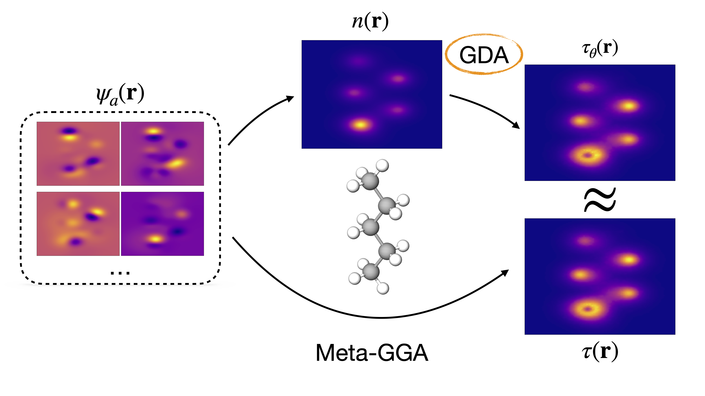
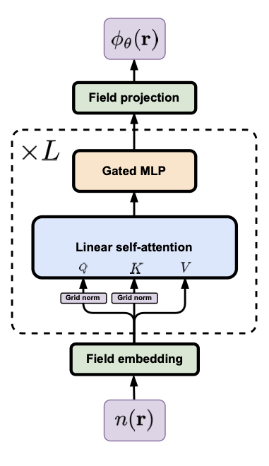

# <h1 align='center'>Global Density Approximation</h1>

Research code for neural-network approximations of electronic density functionals. This code is attached to the following publication:

[INSERT WHEN READY](https://github.com/Matematija/global-density-approximation.git).

Code author: Matija Medvidović

<center>
    
</center>

## Installation

Global density approximations (GDA) is not available through package managers yet. However, you can install it by pointing `pip` to this repository:

```bash
pip3 install 'gda@git+https://github.com/Matematija/global-density-approximation.git'
```

## Basic usage

### GDA as a [PyTorch](https://pytorch.org/) module

<center>
    
</center>

The `gda` package exports only one PyTorch module you can construct in the following way:

```python
import torch
from gda import GlobalDensityApprox

gda = GlobalDensityApprox(embed_dim=128, n_blocks=2)
```

and call to evaluate the function $\phi(\mathbf{r})$:

```python
# Dummy data
n = torch.randn(20000) # shape = (..., grid_size,)
grad_n = torch.randn(20000, 3) # shape = (..., grid_size, 3)
coords = torch.randn(20000, 3) # shape = (..., grid_size, 3)
weights = torch.randn(20000) # shape = (..., grid_size,)

phi = gda.log_tau(n, grad_n, coords, weights)
log_tau = gda.log_tau(n, grad_n, coords, weights)
# Log-tau implemented for numerical stability
```

defined by
$$
\tau (\mathbf{r}) = \tau _W(\mathbf{r}) + e^{\phi (\mathbf{r}) } \left( \tau_U (\mathbf{r}) + \eta \, \tau_W (\mathbf{r}) \right)
$$

where $\tau_U = \frac{3}{10} (3 \pi ^2 )^{2/3} n ^{5/3}$ is the uniform electron gas kinetic energy, $\tau_W = \frac{| \nabla n |^2}{8 n}$ is the von Weizsäcker kinetic functional.

### The [PySCF](https://pyscf.org/) interface

We also provide a custom `RKS` (Restricted Kohn-Sham) DFT class that can be used to run DFT loops using trained GDA models. Example interface: 

```python
from ggda.scf import RKS

ks = RKS(mol)
ks.xc = 'tpss'
ks.gda = gda
ks.grids.level = 1
ks.conv_tol = 1e-5
ks.verbose = 4
ks.kernel()
```

If `RKS.gda` field is not set, then the `RKS.kernel()` method will just run "normal" DFT using PySCF defaults. Furthermore, since the GDA approximation only models the kinetic energy density $\tau (\mathbf{r})$, if the `RKS.xc` field is set to a functional that does not require $\tau$ as an input, unmodified LibXC functionals are called as well.

**[TO DO: TDDFT example]**

### A differentiable [LibXC](https://libxc.gitlab.io/) wrapper

**[TO DO]**
